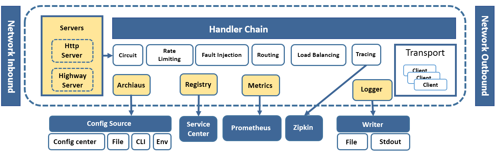

How it works
=========================================

这里解释运行时发生了什么

不同协议请求进入到各协议Server，Server将具体的协议请求转换为Invocation统一抽象模型，并传入Handler chain，在这里Chassis已经默认实现了很多的Handler，比如熔断，限流等，最终再进入Transport handler，使用具体的协议客户端传输到目标。

每次请求生成的监控数据通过http API导出的方式，由Prometheus收集处理

日志可通过扩展，输出到kafka等服务中也可使用华为公有云APM服务收集

注册中心默认对接Service center

Archaius为动态配置框架，可从各种不同的source中读取配置