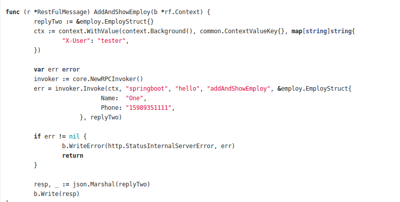
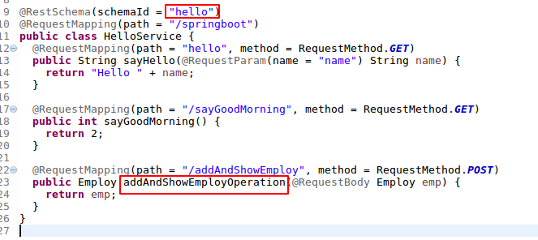

Communication between GO consumer and JAVA provider using highway protocol:
==========================================================================

GO consumer
~~~~~~~~~~~
Go consumer uses invoker.Invoker() call to make highway communication 

`
   Parameters of Invoke:
    1) Context
    2) MicroserviceName
    3) SchemaID
    4) operationID
    5) Input argument
    6) Response argument
 ` 
 
 In the employ.bp.go file the structure EmployeeStruct is been used as the input argument and Response argument
 
 .. image:: images/EmployeeStruct.png 
    :alt: EmployeeStruct

Java provider:
~~~~~~~~~~~~
Microservicename is the name provider in the microservice.yaml file . In this example it is "springboot".

 .. image:: images/microservice.png 
    :alt: microservice.yaml
    
    
SchemaId is the schemaID defined in the java provider. In this example it is "hello".

OperationId is the OperationName in the java provider. In this example it is  "addAndShowEmploy".
   

   
   
Employ class which has the member variables "Name" and "Phone" is used as input parameter for the operation and also response    for this api.

   
   .. image:: images/Employ.png 
      :alt: Employ 
